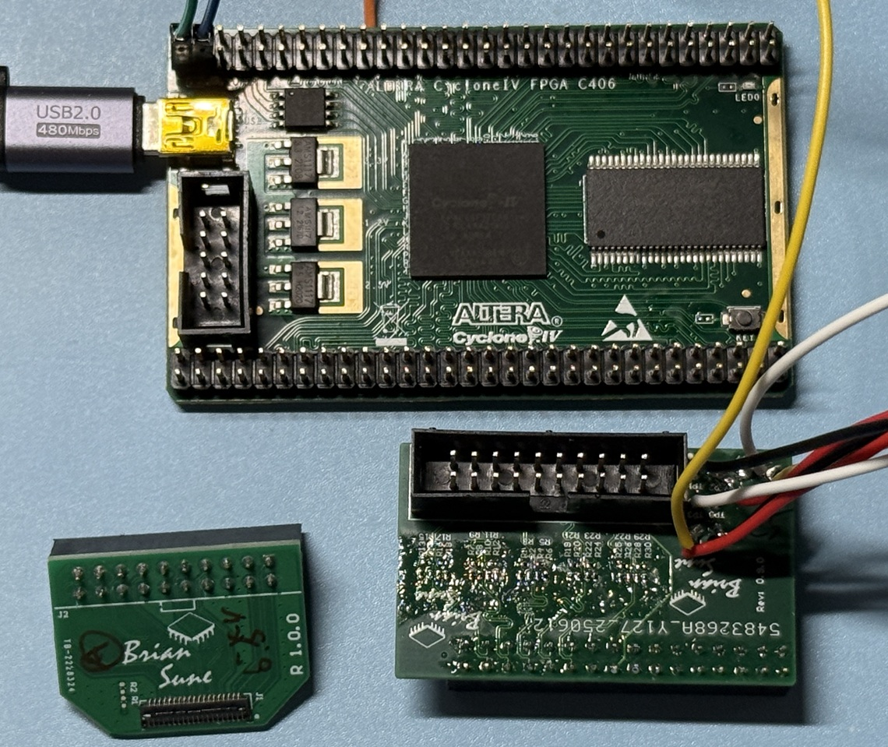
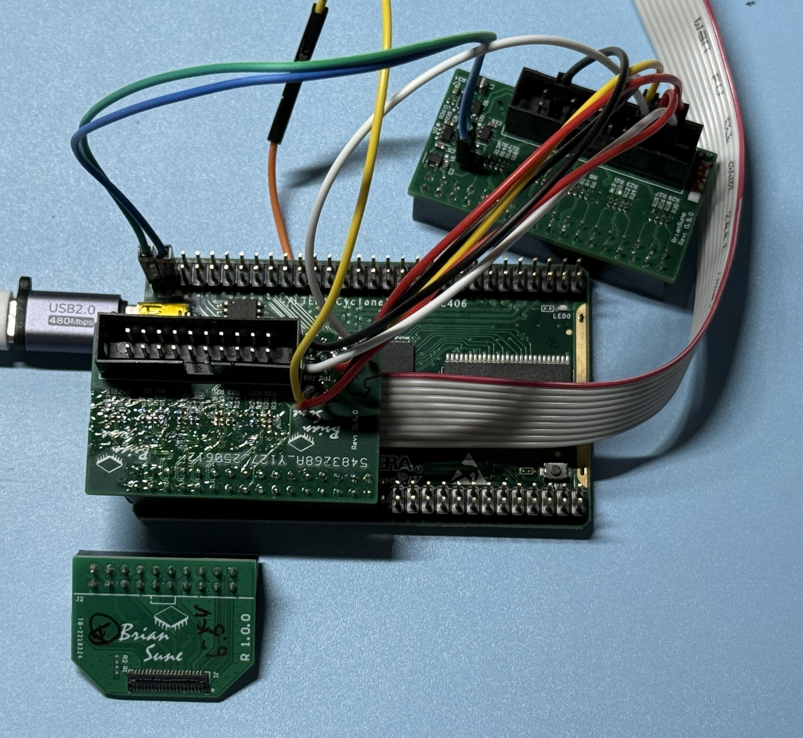
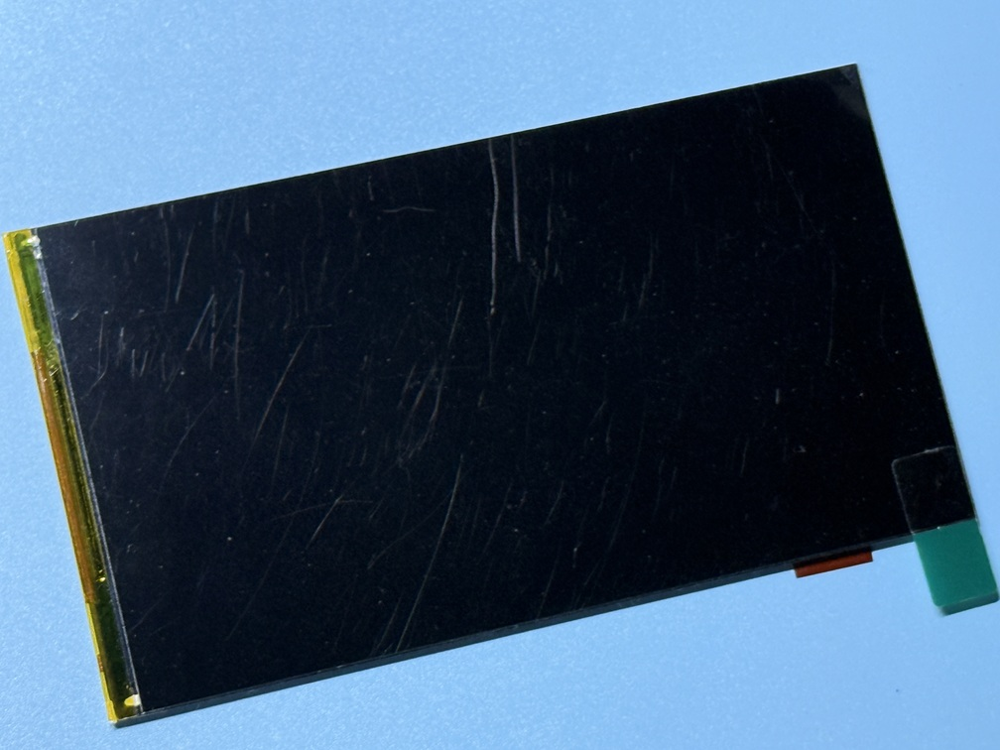
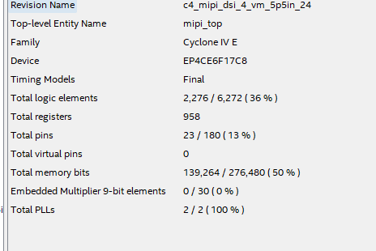

# Cyclone IV MIPI DSI 5.5" LCD

## If this project is constructive, welcome to donate a drink to PayPal.


or

paypal.me/briansune

# More MIPI DSI LCD examples

Please visit [FPGA-LCD-MIPI-or-DPI](https://briansune.github.io/FPGA-LCD-MIPI-or-DPI/) or [FPGA-TFT-MIPI-or-DPI](https://briansune.github.io/FPGA-TFT-MIPI-or-DPI/)

# Background

In the past, many Altera FPGA developers and users wanted to utilize the "MIPI DSI TX Controller Subsystem" IP.

Unfortunately, due to the absence of LPDT, users were unable to initialize the LCD/TFT display. Hence, the usefulness of this built-in Quartus IP was highly limited.

In this project, a novel, ultra-low-resource, Verilog-based HDL design has been developed to address this niche need.

This design requires neither a softcore nor a hardcore (using only pure FSM + LUT), significantly reducing complexity.

Additionally, the design is independent of Quartus IP (excluding inherent FPGA building blocks) and does not require a DPHY IP either.

# Demonstration

## Test Patterns

|BPP,FPS,FPGA,Lanes,I/F|Video|
|:-:|:-:|
|24,40,C4,4,R-Net |[](https://youtube.com/video/x8p5Pm-gIYY)|

# How to obtain the design?

Please contact via EMAIL: briansune@gmail.com

# How to Use?

1) Modify the Python script and convert the initialization LPDT ROM (read-only-memory)
2) Make sure the hardware is MIPI DSI supported. Xilinx FPGA please check [HERE](https://docs.amd.com/v/u/en-US/xapp894-d-phy-solutions) or Altera FPGA please check [HERE](https://cdrdv2-public.intel.com/666639/an754-683092-666639.pdf)
3) Make sure the MMCM and parameters are converged
4) Ensure the MIPI Mbps is lower than 900, which is tested on the 5.5 inch 1080p TFT 60 FPS.

# Hardware

|Description|EVM|
|:-:|:-:|
|FPGA C4-R-Net ||
|Gear C4-R-Net ||
|5.5" LCD      ||

# Project Resource

Remarks A: From the above experiments and implementations, there are no major differences on MC20902 and resistor-network.

Remarks B: The different between resistor-network and level-shifter is w/ or w/o tri-state on the FPGA out-buffer.

|BPP,FPS,FPGA,Lanes|Resources|
|:-:|:-:|
|24,40,C4,4||

# Project Hierarchy

```
 |-mipi_init_script
 | |-four_lanes_lcd_init.txt
 | |-main.py
 | |-mem2mif.py
 | |-mipi_setup_rom.mem
 | |-mipi_setup_rom.mif
 |-mipi_parameters.vh
 |-mipi_phys
 | |-mipi_crc.v
 | |-mipi_ecc.v
 | |-mipi_hs_clk_phy.v
 | |-mipi_hs_phy.v
 | |-mipi_lps_phy.v
 |-mipi_refclks
 | |-mipi_refclks.v
 |-mipi_setup
 | |-mipi_lpdt_setup.v
 | |-mipi_reset.v
 | |-mipi_setup_rom.mem
 | |-mipi_setup_rom.mif
 |-mipi_sim
 | |-tb_mipi_setup.v
 | |-tb_mipi_top.v
 | |-tb_mipi_video.v
 | |-tb_OSERDESE2.v
 |-mipi_top.v
 |-video_src
 | |-mipi_long_vid_pack.v
 | |-mipi_remap.v
 | |-mipi_short_vid_hdr.v
 | |-mipi_video_stream.v
 | |-test_pattern_gen.v
 | |-video_timing_ctrl.v
 |-xpm2altera_macro
 | |-DDIO.ppf
 | |-DDIO.qip
 | |-DDIO.v
 | |-MMCME2_ADV.ppf
 | |-MMCME2_ADV.qip
 | |-MMCME2_ADV.v
 | |-MMCME2_ADV_b.ppf
 | |-MMCME2_ADV_b.qip
 | |-MMCME2_ADV_b.v
 | |-OSERDESE2.v
 | |-OSERDESE2.vbk
 | |-OUTBUF_DIFF.qip
 | |-OUTBUF_DIFF.v
 | |-xpm_cdc_array_single.v
 | |-xpm_cdc_single.v
 | |-xpm_fifo_async.v
 | |-xpm_memory_sprom.qip
 | |-xpm_memory_sprom.v
```
